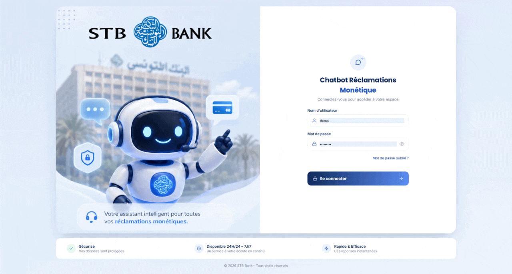

# 🏦 Multilingual Claims Bot — STB Bank

A multilingual, intelligent chatbot for handling **card and payment
complaints** (monetics claims), built during an engineering internship at
**STB Bank** (Société Tunisienne de Banque). It understands and replies in
**French, English, Modern Standard Arabic, and Tunisian Arabic (Darija)** —
by text or voice — and connects a full authentication system, a live
complaint-tracking backend, and a supervisor dashboard into a single
web app.

<!--
  📽️ DEMO — replace the line below with your GIF once added to /docs
  

  For the full video, drag-and-drop the .mp4 into this file on github.com
  (edit mode) — GitHub will host it and generate an embeddable link
  automatically. Paste that link here, or link to YouTube instead:
  [](https://youtube.com/watch?v=YOUR_ID)
-->


---

## ✨ Highlights

- **4-language understanding** (FR / EN / AR / Tunisian Darija), including
  informal, mixed-script messages — not just keyword matching.
- **Multi-issue detection** — a single message like *"my card is blocked
  and I also have a payment limit issue"* is split into a primary and
  secondary complaint, both acknowledged.
- **Smart clarification** — vague messages trigger a targeted follow-up
  question instead of a guessed, possibly wrong classification.
- **Retrieval-Augmented Generation (RAG)** — replies are built
  deterministically from a structured knowledge base of 54 procedure
  sheets, never freely generated, to eliminate hallucinated deadlines or
  procedures.
- **Voice mode** — microphone input transcribed via Whisper, spoken
  replies via text-to-speech (FR/AR).
- **Secure file uploads** — photo/PDF evidence attached to a claim,
  validated by real file-signature checks (not just MIME type), isolated
  per user.
- **Real complaint tracking** — every conversation creates or updates a
  ticket (status, category, linked messages), visible in "My Claims".
- **Supervisor dashboard** — live queue of human-escalation requests
  (Server-Sent Events, no manual refresh), claims breakdown by status and
  category, ticket status updates.
- **Security-first design** — httpOnly session cookies (never JWT in
  localStorage), bcrypt password hashing, rate limiting, account lockout,
  role-based access control, isolated file storage, audit log, a shared
  internal key protecting the Python microservice even if its port is
  accidentally exposed.

---

## 🏗️ Architecture

```
stb-auth/
├── backend/                    Node.js / Express API
│   ├── server.js                HTTP routes, orchestration
│   ├── db.js                    SQLite connection + schema (node:sqlite)
│   ├── users.js                 accounts, password policy
│   ├── reclamations.js          tickets, messages, agent stats
│   ├── feedback.js              👍/👎 rating on bot replies
│   ├── notificationService.js   email/SMS notifications (documented stub)
│   ├── uploadMiddleware.js      evidence upload (Multer + signature check)
│   ├── authMiddleware.js        JWT via httpOnly cookie + role guard
│   ├── chatbotProxy.js          internal calls to chatbot-api
│   ├── auditLog.js              security event log
│   ├── scripts/add-user.js
│   └── .env.example
├── chatbot-api/                Python / FastAPI microservice
│   ├── main.py                  classification (+cache), RAG, voice, degraded mode
│   ├── knowledge_base.py        54 structured procedure sheets
│   ├── requirements.txt
│   └── .env.example
└── frontend/
    ├── index.html                login page
    ├── chat.html                 chat + claims + FAQ + agent dashboard
    ├── styles.css / chat.css
    ├── script.js / chat.js
    └── config.js
```

**Flow:** login → httpOnly session cookie → `chat.html`. Every message goes
through the Node backend (`/api/chat/repondre`), which calls the Python
microservice and persists the conversation: a claim ticket is created or
updated in SQLite, with sub-category, status, and linked messages.

**Why a Node ↔ Python split?** The browser never talks to the Python
service directly. Node is the single authentication and rate-limiting
choke point; the chatbot-api service can stay on a private network,
reachable only from the backend, protected by an internal shared key as a
second, independent barrier.

---

## 🧠 How the chatbot works

```
Client message (text or voice, 4 possible languages)
        │
        ▼
Classification (LLM) ──► one of 54 official sub-categories
        │                 + secondary issues + plain-language summary
        ▼
Retrieval (RAG) ──► matching procedure sheet
        │
        ▼
Deterministic response generation ──► translation if needed
        │
        ▼
Text + audio reply
```

- **Classification cache** (in-memory LRU, 1h TTL): near-identical messages
  don't re-call the LLM.
- **Explicit degraded mode**: if the LLM provider is unreachable, the user
  is told honestly instead of receiving a default classification presented
  with false confidence — and a human escalation ticket is created
  automatically.
- **Darija-aware prompting**: informal Latin-script Tunisian Arabic
  examples are baked into the classification prompt for better recognition
  of real, everyday phrasing.

---

## 👤 User features (agent role)

- Text and voice chat (mic → Whisper transcription; live captions via the
  browser's speech recognition while recording, but the message actually
  sent uses the more reliable Whisper transcription).
- Quick-reply buttons (Card / Payment / ATM / App) for common cases,
  alongside free text.
- Evidence upload (photo or PDF, 8 MB max), stored in a per-user isolated
  folder with a randomized filename, accessible only to its owner (or a
  supervisor).
- **My Claims**: real ticket history, with status (received / in progress
  / resolved) and an evidence indicator.
- 👍/👎 feedback on each bot reply.
- Listen to replies (FR/AR text-to-speech).

## 🛡️ Supervisor features (admin role)

- Dashboard: claims breakdown by status and by sub-category (most frequent
  first).
- Live human-assistance escalation queue (Server-Sent Events, no manual
  refresh), with a "Handle" button to mark a case as taken.
- Ticket status changes, which automatically trigger a notification (email
  — see note below).
- Demo supervisor account: `admin` / `Admin1234!`

> ⚠️ **Email/SMS notifications are a documented stub, not a real send.**
> `notificationService.js` logs the action (console + `notifications_log`
> table) instead of actually emailing/texting, since no SMTP/Twilio
> account is configured in this environment. The interface is ready for a
> real integration (nodemailer, SendGrid, Twilio...) — see the comments in
> the file for the exact spot to plug it in.

---

## 🔒 Security summary

See inline comments in `server.js`, `authMiddleware.js`,
`uploadMiddleware.js`, and `chatbot-api/main.py` for details. In short:
bcrypt-hashed passwords, SQLite with prepared statements, httpOnly session
cookie (never JWT in `localStorage`), password policy, rate limiting
(login + chat), account lockout after repeated failures, a shared internal
key protecting `chatbot-api` even if accidentally exposed, role-based
access control on supervisor routes, per-user file isolation, centralized
error handling (no stack traces leaked to the client), a startup guard
that refuses to run in production with default secrets, and an audit log.

---

## 🚀 Getting started

### 1. Start the Node backend

```bash
cd backend
cp .env.example .env
```

Generate and paste real values for `JWT_SECRET` and `INTERNAL_API_KEY`
(the second one must match exactly in `chatbot-api/.env`, next step):

```bash
node -e "console.log(require('crypto').randomBytes(64).toString('hex'))"
node -e "console.log(require('crypto').randomBytes(32).toString('hex'))"
```

```bash
npm install
npm start
```

> Requires **Node.js ≥ 22.5** (uses the built-in `node:sqlite` module — no
> native compilation needed, unlike packages such as `better-sqlite3`).

Runs on `http://localhost:4000`. Demo accounts created automatically:

| Role | Username | Password |
|---|---|---|
| Agent | `demo` | `Demo1234!` |
| Supervisor | `admin` | `Admin1234!` |

To add a new user (password must satisfy the enforced policy):

```bash
npm run add-user -- username "Full Name" Password2026 agent
```

### 2. Start the Python chatbot microservice

```bash
cd chatbot-api
python -m venv venv && source venv/bin/activate   # Windows: venv\Scripts\activate
pip install -r requirements.txt
cp .env.example .env
```

Edit `.env`: set `GROQ_API_KEY` (your key) and `INTERNAL_API_KEY` (same
value as in `backend/.env`).

```bash
uvicorn main:app --host 0.0.0.0 --port 8001 --reload
```

### 3. Open the frontend

```bash
cd frontend
npx serve .
```

Log in, then test the supervisor dashboard by logging in as `admin` in
another browser/private window while a conversation is ongoing with
`demo`.

---

## 🛠️ Tech stack

| Layer | Technologies |
|---|---|
| Frontend | HTML, CSS, vanilla JavaScript |
| Auth & API gateway | Node.js, Express, JWT (httpOnly cookie), bcrypt, SQLite |
| Chatbot microservice | Python, FastAPI, Groq API (LLM), Whisper (speech-to-text), gTTS (text-to-speech) |
| Data & modeling background | pandas, scikit-learn, google-play-scraper |

---

## 📊 Project background — from raw data to product

This chatbot wasn't built on a toy dataset. A summary of the earlier data
pipeline that shaped it:

- **Data collection**: public CFPB complaint data (US, filtered to
  card/payment categories) via the Kaggle API, plus real Google Play
  reviews scraped for **13 Tunisian banks**.
- **Taxonomy**: 11 main categories / 49 sub-categories defined with the
  internship supervisor, covering the full range of monetics complaints.
- **First classification pass**: LLM-based labeling (Groq — Llama 3,
  later combined with Google Gemini to work around free-tier rate
  limits). Manual audit on a ~200-row sample measured **39% precision**;
  errors were diagnosed, a missing category added, and the prompt
  strengthened with exclusion rules and targeted examples.
- **Synthetic augmentation**: to address under-represented languages
  (notably Darija) and categories, synthetic multilingual data was
  generated and always clearly tagged via a `source` column — never
  presented as real.
- **Key methodological finding**: a naive random train/test split leaked
  near-identical phrasings between sets, inflating a local TF-IDF +
  logistic regression model's accuracy to 99%. Switching to a
  **template-grouped split** revealed the real accuracy: **37%** — which
  motivated the pivot to real-time LLM classification, which generalizes
  natively to natural language without needing thousands of reformulated
  examples.
- **RAG over free generation**: replies are built deterministically from a
  54-entry knowledge base rather than freely generated, to eliminate
  hallucinated deadlines, amounts, or procedures.

---

## ⚠️ Known limitations / before real production use

- [ ] Wire up a real email/SMS provider in `notificationService.js`.
- [ ] Serve over HTTPS only.
- [ ] Replace `knowledge_base.py` with STB's actual internal procedures
      (the current one is illustrative, built without access to real
      internal documentation).
- [ ] Add two-factor authentication (2FA) if required.
- [ ] Host `chatbot-api` on a strictly private network.
- [ ] Back up `backend/stb.db` (now holds claims and evidence references,
      not just accounts) and `backend/uploads/` regularly.
- [ ] Have the bank's security team audit the code before handling real
      customer data.

---

## 📄 License

Academic / internship project. No license specified — all rights reserved
by the author unless stated otherwise.
